# 🤖 RiskShield AI — MLOps & AI Decision Pipeline Architecture

## 1. Machine Learning Architecture Overview

RiskShield AI deploys an ensemble of heterogeneous machine learning models designed for real-time inference, high recall, and low false-positive rates:

```mermaid
flowchart LR
    subgraph INGRESS["Raw Payment Event"]
        TXN["Amount, Currency, Card BIN, IP, Device Hash, Geo"]
    end

    subgraph FEATURE_ENG["Feature Engineering (61 Dimensions)"]
        VELOCITY["Sliding Velocity (1m, 15m, 1h, 24h, 7d)"]
        GEO["Great-Circle Distance & Impossible Travel Speed"]
        TRUST["Customer Trust Score & Lifetime Chargeback Ratio"]
        DEVICE["Proxy, Tor, VPN & Browser Fingerprint Flags"]
    end

    subgraph ENSEMBLE["Multi-Model Inference Mesh"]
        XGB["XGBoost Fraud Classifier\n(P_xgb)"]
        ONNX["ONNX Chargeback Predictor\n(P_onnx)"]
        LGBM["LightGBM Merchant Scorer\n(P_lgbm)"]
        ISO["Isolation Forest Anomaly Radar\n(S_iso)"]
    end

    subgraph SYNTHESIS["Composite Score Aggregator"]
        WEIGHTS["Dynamic Ensemble Weighting"]
        RULE_BIAS["Deterministic Rule Overrides"]
        SCORE["Composite Risk Score (0 - 100)"]
    end

    INGRESS --> FEATURE_ENG
    FEATURE_ENG --> ENSEMBLE
    ENSEMBLE --> SYNTHESIS
    SYNTHESIS --> SCORE
```

---

## 2. Model Zoo & Specifications

### 2.1 Model Specification Table
| Model Name | Framework | Task | Training Objective | P99 Latency | Deployment Tier |
| :--- | :--- | :--- | :--- | :--- | :--- |
| **XGBoost Fraud Classifier v1** | XGBoost (v2.1+) | Supervised Binary Classification | Maximize PR-AUC on imbalanced card dataset | `2.1 ms` | Real-time In-Process |
| **ONNX Chargeback Predictor v1** | ONNX Runtime (C++) | Supervised Regression | Minimize Log-Loss on 90-day dispute likelihood | `0.8 ms` | Real-time In-Process |
| **LightGBM Merchant Scorer v1**| LightGBM | Multi-class Risk Tiering | Categorize merchant risk (Low, Medium, High, Critical) | `1.4 ms` | Real-time In-Process |
| **Isolation Forest Anomaly Radar**| Scikit-Learn | Unsupervised Outlier Detection | Unveil zero-day attack vectors without labels | `1.2 ms` | Real-time In-Process |
| **Groq Llama-3 Forensic Copilot**| Llama-3.1-8B-Instant | Generative Causal Synthesis | Synthesize telemetry into investigator briefing | `420 ms` | On-Demand (Analyst HUD) |

---

## 3. Mathematical Risk Formulation

### 3.1 Supervised Ensemble Synthesis
The raw probabilistic output of the supervised classifiers is weighted according to empirical backtest accuracy:

$$P_{\text{supervised}} = 0.50 \cdot P_{\text{XGB}} + 0.35 \cdot P_{\text{ONNX}} + 0.15 \cdot P_{\text{LGBM}}$$

### 3.2 Unsupervised Anomaly Penalty
Isolation Forest produces an anomaly score $s \in [-1, 1]$, where negative values indicate severe outliers:

$$A_{\text{norm}} = \max\left(0, -s_{\text{iso}}\right)$$

### 3.3 Unified Composite Risk Score
The final composite risk score $R \in [0, 100]$ combines model probabilities with deterministic rule penalties:

$$R = \min\left(100, \left(P_{\text{supervised}} \times 70\right) + \left(A_{\text{norm}} \times 30\right) + \Delta_{\text{rules}}\right)$$

Where $\Delta_{\text{rules}}$ is an additive penalty triggered by active policy violations.

---

## 4. Model Drift & Population Stability Monitoring

Model degradation is monitored continuously using the **Population Stability Index (PSI)** across all 61 input features:

$$\text{PSI} = \sum_{b=1}^{B} \left( \text{Actual}_b - \text{Expected}_b \right) \times \ln\left(\frac{\text{Actual}_b}{\text{Expected}_b}\right)$$

- **$\text{PSI} < 0.10$**: Optimal stability. No retraining required.
- **$0.10 \le \text{PSI} < 0.25$**: Moderate shift detected. Model retraining queued.
- **$\text{PSI} \ge 0.25$**: Critical distribution drift. Automatic alert dispatched to ML Engineering team; traffic routed to conservative AST rules.
