# 🏛️ RiskShield AI — Enterprise System Architecture Specification

## 1. Architectural Philosophy

RiskShield AI is engineered using **Clean Architecture** and **Domain-Driven Design (DDD)** principles to achieve maximum modularity, testability, and sub-millisecond throughput. The system strictly separates concerns across 4 architectural rings:

```
+-------------------------------------------------------------+
|                     1. Presentation Layer                   |
|          (FastAPI REST Endpoints & Next.js 14 App Router)   |
+-------------------------------------------------------------+
                              |
                              v
+-------------------------------------------------------------+
|                    2. Orchestration Layer                   |
|         (Decision Engine, Feature Ingestion, AI Hub)        |
+-------------------------------------------------------------+
                              |
                              v
+-------------------------------------------------------------+
|                    3. Domain Business Logic                 |
|       (AST Rule Evaluator, ML Inference Mesh, Graph)        |
+-------------------------------------------------------------+
                              |
                              v
+-------------------------------------------------------------+
|                   4. Persistence & Infrastructure           |
|        (SQLAlchemy Async, Redis 7, Celery, MongoDB)         |
+-------------------------------------------------------------+
```

---

## 2. Component Topology & Data Flow

```mermaid
flowchart TB
    subgraph CLIENT["Client Ingress"]
        GATEWAY["E-Commerce / Payment Gateway"]
        CONSOLE["Risk Analyst Web Console (Next.js)"]
    end

    subgraph MIDDLEWARE["Security & Edge Gateway"]
        RATELIMIT["Token-Bucket Rate Limiter"]
        CORS["CORS & Origin Validation"]
        SEC_HEADERS["HSTS, CSP & Security Headers"]
        CORRELATION["UUIDv4 Correlation ID Injector"]
    end

    subgraph CORE_SERVICES["FastAPI Async Microservices"]
        AUTH_SVC["Authentication & RBAC Service"]
        DECISION_ENG["Autonomous Decision Engine"]
        RULE_COMPILER["AST Policy Compiler & Evaluator"]
        ML_MESH["Multi-Model Inference Mesh"]
        FEATURE_STORE["Streaming Feature Store Service"]
        GRAPH_SVC["Entity Relationship Graph Service"]
        CASE_SVC["Forensic Case Management Service"]
        EXPLAIN_SVC["TreeSHAP Explainability Service"]
        COPILOT_SVC["Groq Llama-3 Forensic Copilot"]
    end

    subgraph DATA_TIER["Persistence & Cache Infrastructure"]
        PG_DB[("PostgreSQL 16 / SQLite Engine")]
        REDIS_CACHE[("Redis 7 Feature & Lock Store")]
        MONGO_AUDIT[("MongoDB Audit & Graph Store")]
        CELERY_QUEUE[("Celery Task Broker & Worker")]
    end

    CLIENT --> MIDDLEWARE
    MIDDLEWARE --> CORE_SERVICES
    CORE_SERVICES --> DATA_TIER
```



---

## 3. The Dual Decision Engine Architecture

RiskShield AI eliminates the latency and false-positive pitfalls of single-strategy fraud systems by combining a **Deterministic Policy Rule Engine** with a **Probabilistic Machine Learning Mesh**.

### 3.1 Deterministic Policy Rule Engine (AST Compiler)
- **Design Pattern**: Abstract Syntax Tree (AST) Parsing using Python's native `ast` module.
- **Safety Guarantee**: Insecure `eval()` and `exec()` calls are strictly forbidden. The compiler parses expressions (e.g., `amount > 5000 and velocity_1h > 3`) into a verified syntax tree that evaluates only against a sanitized variable scope.
- **Latency**: `<0.8 ms` average evaluation time.
- **Conflict Resolution**: When multiple rules match, the `ConflictResolutionService` executes a deterministic priority ladder:
  $$\text{Action} = \min_{\text{priority}} \{\text{Rule}_i \mid \text{Condition}_i = \text{True}\}$$

### 3.2 Machine Learning Inference Mesh
- **Parallel Asynchronous Execution**: Multiple models evaluate the feature vector concurrently using `asyncio.gather()`:
  1. **XGBoost Fraud Classifier**: Captures non-linear feature interactions and velocity spikes.
  2. **LightGBM Merchant Scorer**: Evaluates merchant risk profile and seasonal volume deviations.
  3. **ONNX Runtime Chargeback Predictor**: Predicts 90-day dispute probability in `<1 ms`.
  4. **Isolation Forest**: Identifies zero-day outlier patterns with no historical precedent.
- **Composite Risk Aggregation**:
  $$\text{Composite Score} = w_1 \cdot P_{\text{XGB}} + w_2 \cdot P_{\text{ONNX}} + w_3 \cdot S_{\text{Anomaly}} + \text{Rule Penalty}$$

---

## 4. Streaming Feature Store Architecture

The Feature Store maintains real-time feature parity between online inference and offline retraining:

1. **Online Serving Tier (Redis 7)**:
   - Sliding-window velocity counters (1m, 5m, 1h, 24h, 7d).
   - In-memory key-value lookups with TTL expiration.
   - P99 retrieval latency: `<2.1 ms`.
2. **Offline Retraining Tier (PostgreSQL / Data Lake)**:
   - Append-only feature logs capturing the exact 61-dimension feature snapshot evaluated at decision time.
   - Eliminates feature leakage during model backtesting and periodic retraining.

---

## 5. Resilience & Fault-Tolerance Principles

- **Graceful Degradation**: If an external ML model or LLM service times out, the Decision Engine falls back to deterministic AST rules, ensuring zero transaction drops.
- **Circuit Breaker**: Implemented on all third-party integrations (Groq LLM API, external KYC providers) to prevent cascading thread exhaustion.
- **Idempotency**: All transaction ingestion endpoints enforce idempotency keys using Redis distributed locks.
