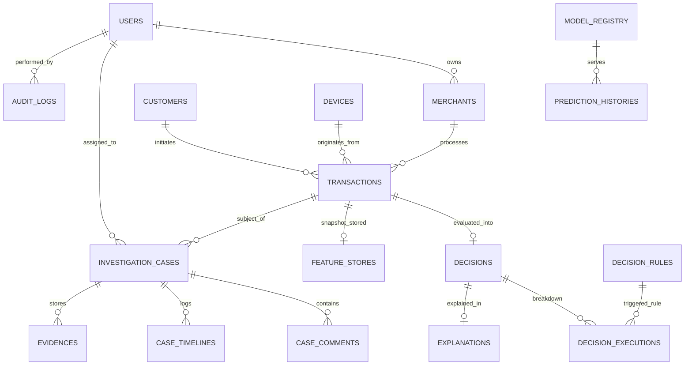

# 🗄️ RiskShield AI — Enterprise Database Schema & Data Dictionary

RiskShield AI utilizes a hybrid persistence model:
1. **Relational Core (PostgreSQL 16 / Async SQLAlchemy 2.0)**: Guarantees strict ACID consistency for users, merchants, payment transactions, decision audits, and investigation cases.
2. **In-Memory Cache (Redis 7)**: Provides sub-millisecond retrieval of sliding velocity counters and distributed concurrency locks.
3. **Document & Graph Store (MongoDB Atlas)**: Stores unstructured JSON investigation evidence, model explanation vectors, and node-link entity graphs.

---

## 1. Entity Relationship Diagram (ERD)

---

## 2. Core Data Dictionary

### 2.1 `transactions` Table
| Column | Type | Constraints | Description |
| :--- | :--- | :--- | :--- |
| `id` | `UUID` | `PRIMARY KEY` | Internal surrogate unique identifier |
| `transaction_id` | `VARCHAR(50)` | `UNIQUE, NOT NULL, INDEX` | External reference ID (e.g. `TXN-ML-PRED-991`) |
| `merchant_id` | `UUID` | `FOREIGN KEY (merchants.id)` | Onboarded merchant processing the charge |
| `customer_profile_id` | `UUID` | `FOREIGN KEY (customers.id)` | Resolved customer profile entity |
| `device_profile_id` | `UUID` | `FOREIGN KEY (devices.id)` | Fingerprinted client device entity |
| `payment_method` | `ENUM` | `NOT NULL` | Payment channel (`UPI`, `Credit Card`, `Debit Card`, `Wallet`) |
| `card_bin` | `VARCHAR(20)` | `NULLABLE, INDEX` | First 6 digits of payment instrument |
| `amount` | `NUMERIC(12, 2)` | `NOT NULL` | Authorized transaction amount |
| `currency` | `VARCHAR(10)` | `NOT NULL, DEFAULT 'USD'` | ISO 4217 3-letter currency code |
| `status` | `ENUM` | `NOT NULL` | Transaction state (`Pending`, `Success`, `Failed`, `Chargeback`) |
| `risk_score` | `FLOAT` | `NULLABLE` | Cached risk evaluation score (0 - 100) |
| `created_at` | `TIMESTAMP` | `NOT NULL, INDEX` | Ingress event timestamp (UTC) |

### 2.2 `decisions` Table
| Column | Type | Constraints | Description |
| :--- | :--- | :--- | :--- |
| `id` | `UUID` | `PRIMARY KEY` | Unique decision evaluation record ID |
| `decision_id` | `VARCHAR(50)` | `UNIQUE, NOT NULL, INDEX` | Public decision reference (e.g. `DEC-B7AC0057`) |
| `transaction_id` | `VARCHAR(50)` | `NOT NULL, INDEX` | Linked external transaction identifier |
| `decision` | `VARCHAR(50)` | `NOT NULL, INDEX` | Automated outcome (`APPROVE`, `REVIEW`, `BLOCK`, `ESCALATE`) |
| `composite_risk_score` | `FLOAT` | `NOT NULL` | Final synthesized risk score (0.0 to 100.0) |
| `decision_confidence` | `FLOAT` | `NOT NULL` | Ensemble model confidence metric (0.0 to 1.0) |
| `decision_reason` | `VARCHAR(255)` | `NOT NULL` | Human-readable primary explanation rationale |
| `triggered_rules` | `JSON` | `NOT NULL, DEFAULT '[]'` | Array of rule codes triggered during AST evaluation |
| `execution_time_ms` | `FLOAT` | `NOT NULL` | End-to-end evaluation duration in milliseconds |
| `is_deleted` | `BOOLEAN` | `NOT NULL, DEFAULT FALSE` | Soft-deletion indicator for audit compliance |

---

## 3. Database Migration Governance

- All schema modifications must be scripted as versioned migrations in `backend/alembic/versions/`.
- Zero-downtime migration protocol:
  1. **Expand Phase**: Add new nullable columns or tables.
  2. **Migrate Phase**: Deploy updated application code writing to both schemas.
  3. **Contract Phase**: Deprecate legacy columns via backward-compatible views.
