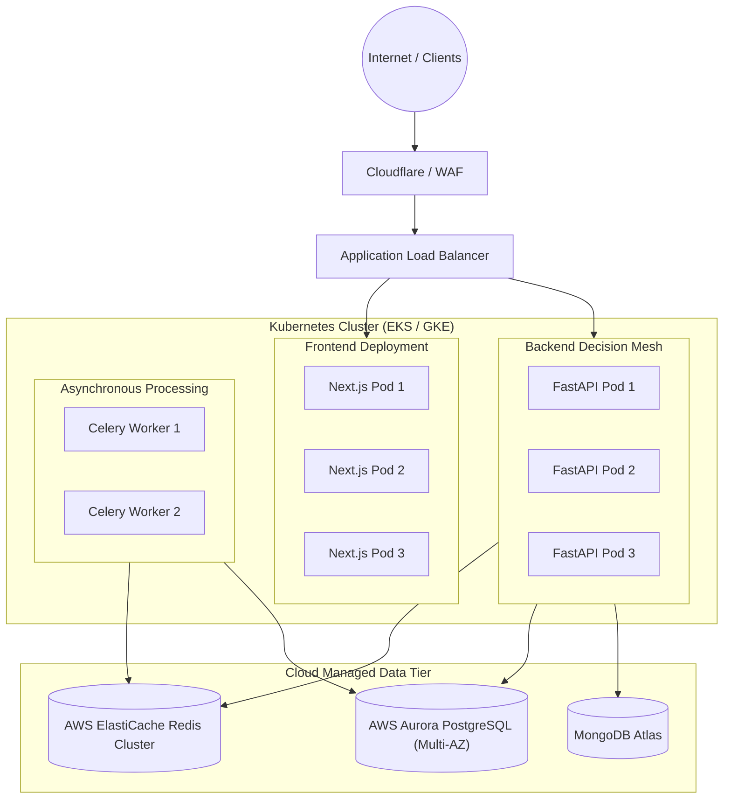

# 🚀 RiskShield AI — Enterprise Production Deployment Guide

## 1. Production Architecture Topology

In a production environment, RiskShield AI runs as a horizontally scalable microservice cluster behind a cloud load balancer (AWS ALB, GCP Cloud Load Balancing, or Cloudflare):



---

## 2. Docker Production Deployment

### 2.1 Launching with Production Docker Compose
The repository includes `docker-compose.prod.yml` configured with resource limits, health checks, and log rotation:

```bash
# 1. Export production secrets
export SECRET_KEY="$(openssl rand -hex 32)"
export POSTGRES_PASSWORD="secure_strong_production_password"

# 2. Build and launch containers in background
docker-compose -f docker-compose.prod.yml up --build -d

# 3. Monitor container health
docker-compose -f docker-compose.prod.yml ps
```

---

## 3. Kubernetes Manifests (Helm / Kustomize)

### 3.1 Horizontal Pod Autoscaling (HPA)
```yaml
apiVersion: autoscaling/v2
kind: HorizontalPodAutoscaler
metadata:
  name: riskshield-backend-hpa
spec:
  scaleTargetRef:
    apiVersion: apps/v1
    kind: Deployment
    name: riskshield-backend
  minReplicas: 3
  maxReplicas: 25
  metrics:
  - type: Resource
    resource:
      name: cpu
      target:
        type: Utilization
        averageUtilization: 70
  - type: Resource
    resource:
      name: memory
      target:
        type: Utilization
        averageUtilization: 80
```

---

## 4. Zero-Downtime Rolling Update Protocol

1. **Pre-flight Check**: Run automated unit and integration tests against staging.
2. **Database Migration**: Apply non-destructive Alembic migrations (`alembic upgrade head`).
3. **Rolling Pod Deployment**: Deploy new backend container images using `maxSurge: 25%` and `maxUnavailable: 0%`.
4. **Health Check Probing**: Kubernetes waits for `/api/v1/health` to return `200 OK` before routing ingress traffic.
5. **Rollback Trigger**: If error rates exceed 0.05% within 5 minutes, deployment rolls back automatically.
