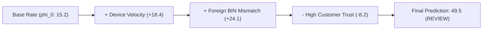

# 🔬 RiskShield AI — Enterprise Explainability & SHAP Forensic Whitepaper

## 1. Regulatory Context & Compliance Mandate

Financial regulators globally require automated credit and risk systems to provide clear, actionable, and non-discriminatory reasons when declining transactions or taking adverse action against consumers:
- **FCRA (Fair Credit Reporting Act)**: Section 615(a) requires specific reason codes for adverse actions.
- **GDPR (General Data Protection Regulation)**: Article 22 establishes the consumer's right to an explanation for solely automated decisioning.
- **PCI-DSS v4.0**: Mandates tamper-evident logging of automated security controls and decision rationales.

RiskShield AI solves this challenge through **TreeSHAP (SHapley Additive exPlanations)** and **Cryptographically Signed Audit Logs**.

---

## 2. Mathematical Foundation of TreeSHAP

SHAP values are rooted in cooperative game theory, guaranteeing four essential axiomatic properties: **Efficiency**, **Symmetry**, **Dummy Player**, and **Additivity**.

For any decision evaluation $x$, the model prediction $f(x)$ decomposes exactly into the base expected value $\phi_0$ plus the sum of local feature attributions $\phi_i(x)$:

$$f(x) = \phi_0 + \sum_{i=1}^{M} \phi_i(x)$$

Where:
- $\phi_0 = \mathbb{E}[f(z)]$ is the baseline expected risk score across the general transaction population.
- $\phi_i(x)$ is the marginal contribution of feature $i$ toward pushing the prediction toward or away from fraud.

---

## 3. Automated Adverse Action Reason Generation

When a transaction is blocked or routed for manual review, the **Explanation Engine** maps the top negative SHAP attributions directly to regulatory-compliant reason codes:

| Feature Name | SHAP Impact | Regulatory Reason Code | Investigator Description |
| :--- | :--- | :--- | :--- |
| `card_velocity_1h` | `+ 0.384` | `VELOCITY_BURST_EXCEEDED` | High transaction frequency detected for payment instrument within 60 minutes. |
| `geo_distance_delta_km` | `+ 0.291` | `IMPOSSIBLE_TRAVEL_SPEED` | Physical distance between successive transactions exceeds commercial airline velocities. |
| `device_proxy_score` | `+ 0.245` | `HIGH_RISK_ANONYMIZER` | Connection originated from known commercial VPN, Tor exit node, or residential proxy mesh. |
| `customer_trust_score` | `- 0.180` | `ESTABLISHED_REPUTATION` | Longstanding verified account history with zero prior chargeback disputes (Mitigating Factor). |

---

## 4. Cryptographic Audit Log Verification

Every explanation record generated by RiskShield AI is bound to its decision payload and cryptographically hashed:

$$\text{Audit Hash} = \text{HMAC-SHA256}\left(\text{Decision ID} \parallel \text{Txn ID} \parallel \text{Timestamp} \parallel \vec{\phi}, K_{\text{audit}}\right)$$

This hash is written directly into the immutable audit ledger. If an investigator, auditor, or external bank regulator requests proof of non-tampering, the signature can be verified in constant time.
