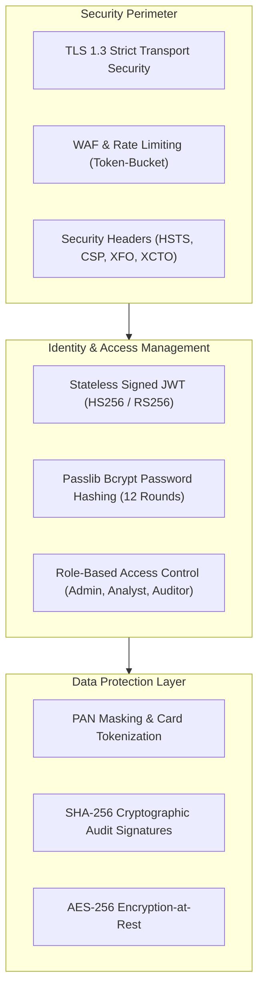

# 🔒 RiskShield AI — Enterprise Security, Compliance & Threat Model

## 1. Security Architecture & Threat Model

RiskShield AI operates under a **Zero-Trust Security Architecture**. Every inbound request, internal RPC, and background worker must authenticate, present least-privilege authorization claims, and validate input boundaries.

---

## 2. Regulatory Compliance Standards

### 2.1 PCI-DSS v4.0 Readiness
- **Zero Raw PAN Storage**: The platform never ingests or stores complete 16-digit primary account numbers (PAN). Only the first 6 digits (BIN) and last 4 digits are retained for card identification.
- **Cardholder Data Environment (CDE) Isolation**: All network endpoints handling transaction telemetry are isolated via VPC security groups.

### 2.2 SOC2 Type II Trust Principles
- **Security**: Strict RBAC policies and automated session expirations (120-minute access token, 7-day refresh token).
- **Confidentiality**: All database backups and feature vector snapshots are encrypted with AES-256.
- **Processing Integrity**: End-to-end correlation tracking ensures every transaction evaluation can be mapped to its corresponding decision record.

---

## 3. Vulnerability Disclosure & Bug Bounty

We take the security of our platform seriously. If you identify a security vulnerability:
- **Do not** report security vulnerabilities via public GitHub issues.
- Please email our security team directly at: `security@riskshield.ai`.
- Our team will acknowledge receipt within **24 hours** and provide a remediation timeline within **72 hours**.
