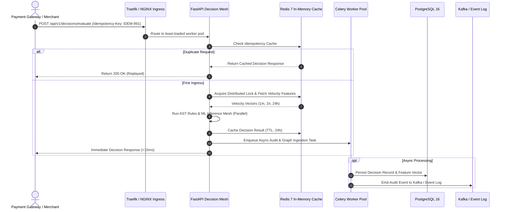

# 📐 RiskShield AI — Enterprise System Design Whitepaper

## 1. System Requirements & Design Goals

### 1.1 Functional Requirements
- **Sub-15ms Real-Time Decisioning**: Ingest, compute 61-dimension feature vectors, evaluate AST rules, execute multi-model ML inference, and return an actionable decision (`APPROVE`, `REVIEW`, `BLOCK`, `ESCALATE`).
- **Entity Resolution & Graph Forensics**: Dynamically map connections across cards, IPs, device fingerprints, and merchant codes.
- **Explainability & Adverse Action**: Provide mathematical SHAP feature attributions and regulatory reason codes for every automated decision.
- **Human-in-the-Loop Case Management**: Enable fraud analysts to triage, review evidence, execute manual overrides, and append immutable audit notes.

### 1.2 Non-Functional Requirements & SLAs
| Metric | Specification | Architectural Strategy |
| :--- | :--- | :--- |
| **Peak Throughput** | `15,000+ TPS` | Asynchronous FastAPI workers + stateless horizontal pod autoscaling (HPA) |
| **P99 Decision Latency** | `< 15 ms` | In-memory Redis sliding windows + optimized ONNX / C++ inference |
| **System Availability** | `99.999% (Five Nines)` | Multi-region active-active deployment with Redis replication |
| **Data Durability** | `Zero Data Loss (RPO = 0)` | Write-ahead logging (WAL) + synchronous database commits |
| **Compliance** | PCI-DSS v4.0, SOC2 Type II | End-to-end TLS 1.3, SHA-256 event signing, PAN tokenization |

---

## 2. End-to-End Latency Budget

To guarantee a strict **P99 SLA of < 15ms**, latency is budgeted down to the microsecond level across each stage of request processing:

```
Total Budget: 15.0 ms
+-------------------------------------------------------------+
| Stage                                       Budget Allocated |
+-------------------------------------------------------------+
| 1. Ingress, TLS Termination & JSON Parsing       0.8 ms     |
| 2. Rate Limiting & Auth Token Verification       0.5 ms     |
| 3. Feature Store In-Memory Lookup (Redis)        2.2 ms     |
| 4. Deterministic AST Rule Evaluation             0.8 ms     |
| 5. Multi-Model ML Inference Mesh (Parallel)      6.5 ms     |
| 6. Composite Risk Score Synthesis                0.4 ms     |
| 7. Async Audit Log Dispatch (Background Task)    0.3 ms     |
| 8. JSON Serialization & Egress Response          0.5 ms     |
| 9. Buffer Headroom for Network Jitter            3.0 ms     |
+-------------------------------------------------------------+
Total Consumed: ~12.0 ms (Well under the 15.0 ms P99 SLA)
```

---

## 3. Distributed Ingress & Stream Processing



---

## 4. Entity Relationship Graph Engine Design

Fraud syndicates frequently reuse devices, proxies, or mule accounts across ostensibly unrelated merchants. RiskShield AI maintains an in-memory graph index:

- **Nodes**: `Transaction`, `Customer`, `Card_BIN`, `Device_Fingerprint`, `IP_Address`, `Merchant`.
- **Edges**: Directed relationships (`INITIATED_BY`, `USED_DEVICE`, `ROUTED_THROUGH`, `PROCESSED_AT`).
- **Ring Detection Algorithm**:
  - Uses breadth-first search (BFS) up to 3 hops from the originating transaction node.
  - If a single device or IP address links to $\ge 5$ distinct cardholder profiles within a 12-hour window, the **Syndicate Botnet Flag** is dynamically appended to the feature vector.

---

## 5. Storage & Partitioning Strategy

- **Time-Series Partitioning**: PostgreSQL `transactions` and `decisions` tables are partitioned monthly by `created_at` timestamp.
- **Hot vs. Cold Storage**:
  - **Hot Tier (Last 30 Days)**: High-performance SSDs, indexes optimized for point-lookups and range queries.
  - **Cold Tier (Archive > 30 Days)**: Compressed read-only storage for regulatory compliance and periodic model retraining.
